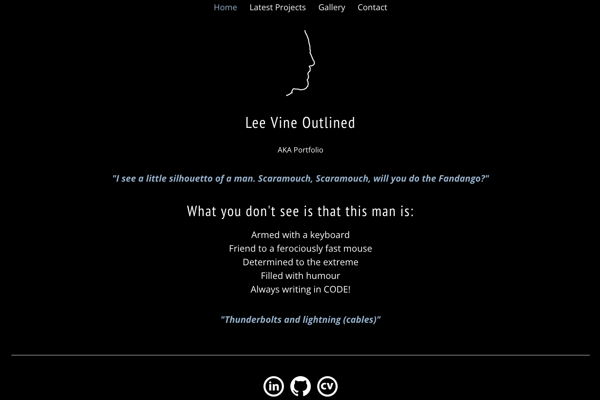
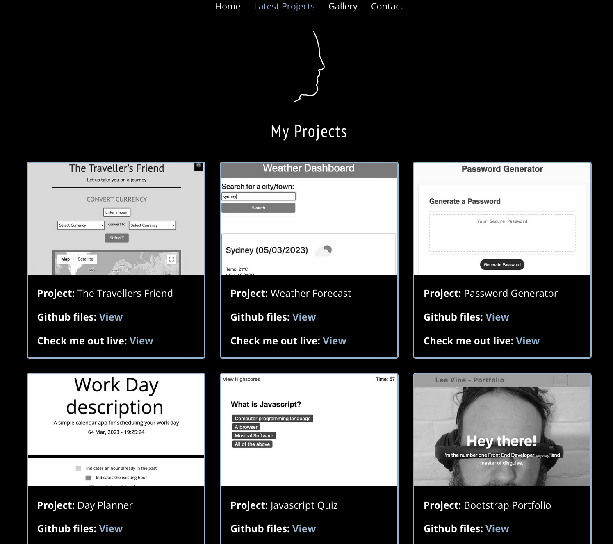

# README.md Portfolio usining React

## Overview
Personal coding portfolio constructed using React. Utilizing Bootstrap and custom CSS.

A one page application with dynamically created content.

Some elements utilize data object contained within json file.

Showcasing projects with information and links to both github repos and live site.

Gallery displaying images of projects.

Contact with submittable form, links to social, CV and github.

### Home view

  

### Project view utilizing json

  

## Links
- Repo URL: https://github.com/leedvine/my-react-portfolio
- Live site: https://leedvine.github.io/my-react-portfolio/
  

### Built using
- React, Node.js, Javascript and Bootstrap.
  

## What I learned
The React.js framework is an open-source JavaScript framework and library developed by Facebook. It’s used for building interactive user interfaces and web applications quickly and efficiently with significantly less code than you would with vanilla JavaScript.

In React, you develop your applications by creating reusable components that you can think of as independent Lego blocks. These components are individual pieces of a final interface, which, when assembled, form the application’s entire user interface.   
 

### Useful resources
https://reactjs.org/docs/getting-started.html
  

## Contributors
Lee Vine
GitHub - https://github.com/leedvine
  

## Questions
Please feel free to reach out to me here leedvine@gmail.com
  

## Installation
Clone repo here https://github.com/leedvine/my-react-portfolio
Local stystem requires React, node.js and Bootstrap to be installed.
  

## License
MIT license

